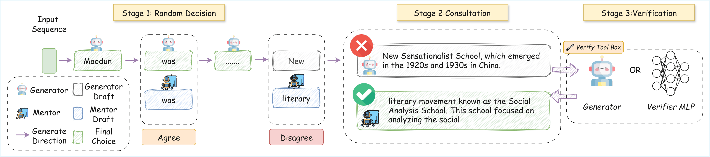

# MentorCollab

> This is the official repo for **MENTORCOLLAB: Selective Large-to-Small Inference-Time Guidance for Efficient Reasoning**

A dual-model collaborative inference system that dynamically routes between base and expert models for efficient and accurate multi-task language understanding and reasoning.

## Overview

MentorCollab implements an innovative inference framework that dynamically selects models based on task difficulty:
- **Base Model**: Handles straightforward tasks efficiently (smaller model)
- **Expert Model**: Tackles complex problems for better accuracy (larger model)
- **Decision Mechanism**: When models disagree, uses self-consultation or MLP prediction to select the optimal output

## Architecture



## Main Components

### Core Files

| File | Description |
|------|-------------|
| `src/mentorcollab_free.py` | Self-consultation decision version with parallel processing support |
| `src/mentorcollab_mlp.py` | MLP-based decision version using a trained neural network for routing |
| `src/utils.py` | Utility functions including `BranchPredictionMLP` model and prompt templates |

### Core Class: TripleModelGenerator

| Method | Description |
|--------|-------------|
| `__init__()` | Initialize models, tokenizers, and optionally MLP model |
| `_test_connections()` | Verify vLLM endpoint connections and model name matching |
| `generate_sequence()` | Call vLLM API to generate token sequences |
| `get_next_token_with_logits()` | Get next token and probability distribution |
| `calculate_entropy()` | Calculate entropy of top-k softmax scores (free version) |
| `extract_hidden_state_at_branch()` | Extract hidden states for MLP decision (MLP version) |
| `predict_branch_with_mlp()` | Use MLP to predict branch choice (MLP version) |
| `generate_with_triple_model()` | Main inference loop orchestrating routing logic |

### BranchPredictionMLP

A neural network for branch prediction with architecture:
- Input: hidden_size from language model
- MLP: hidden_size → 2×hidden_size → hidden_size → hidden_size/2
- Output: sigmoid score (>0.5 → Option A, ≤0.5 → Option B)

## Tech Stack

- **PyTorch**: Deep learning framework
- **Transformers**: Hugging Face model library
- **vLLM**: High-performance inference server
- **Datasets**: Hugging Face datasets library
- **NumPy**: Numerical computation
- **YAML**: Configuration for prompt templates

## Usage

### Prerequisites

1. Start vLLM services:
   - Base model: port 8000 (default)
   - Expert model: port 8001 (default)

2. Prepare dataset files (if using local data):
   - `data/mmlu_pro_test` and `data/mmlu_pro_train` for MMLU-Pro
   - `Com2/benckmark/` for Com2 Hard dataset

### Running Inference

**Self-consultation version (Free):**
```bash
python src/mentorcollab_free.py \
    --base_model <generator_model_name> \
    --expert_model <mentor_model_name> \
    --benchmark mmlu_pro \
    --num_samples 500 \
    --max_new_tokens 512 \
    --drop_proportion 5 \
    --max_workers 4
```

**MLP-based version:**

You can download the MLP model from [Hugging Face](https://huggingface.co/SeanWang0027/MentorCollab-MLP).

```bash
python src/mentorcollab_mlp.py \
    --base_model <generator_model_name> \
    --expert_model <mentor_model_name> \
    --benchmark mmlu_pro \
    --use_mlp \
    --mlp_path <mlp_model_path> \
    --mlp_threshold 0.5 \
    --reference_model <reference_model_for_hidden_states> \
    --num_samples 500
```

### Key Arguments

| Argument | Description | Default |
|----------|-------------|---------|
| `--base_model` | Path/name of generator model (must be in MODEL_NAME_DICT) | Required |
| `--expert_model` | Path/name of mentor model (must be in MODEL_NAME_DICT) | Required |
| `--benchmark` | Dataset name (mmlu_pro, MATH, supergpqa, minerva, com_hard_intervention, arc_challenge) | mmlu_pro |
| `--num_samples` | Number of samples to process | 500 |
| `--max_new_tokens` | Maximum tokens to generate | 512 |
| `--base_port` | Port for generator model vLLM endpoint | 8000 |
| `--expert_port` | Port for mentor model vLLM endpoint | 8001 |
| `--drop_proportion` | Percentage of samples to skip mentor consultation (1-100) | 5 |
| `--complete_tokens` | Number of tokens for completion comparison | 16 |
| `--split` | Dataset split to use | test |
| `--subject` | Subject filter for MMLU-Pro/SuperGPQA | None |
| `--few-shot` | Whether to use few-shot prompting (yes/no) | yes |
| `--max_workers` | Parallel workers for processing (free version) | 1 |

**MLP-specific Arguments:**

| Argument | Description | Default |
|----------|-------------|---------|
| `--use_mlp` | Enable MLP-based decision | False |
| `--mlp_path` | Path to trained MLP model (.pth file) | None |
| `--mlp_threshold` | MLP decision threshold | 0.5 |
| `--reference_model` | Reference model for extracting hidden states | None |
| `--reference_device` | Device for reference model | cuda:4 |

## Decision Strategies

### Self-consultation Version (Free)
1. Generate word from generator model
2. Random sampling decides whether to consult mentor (based on drop_proportion)
3. If consulting: compare generator and mentor model outputs
4. When outputs differ: generate completion sequences from both models
5. Use self-consultation prompt to choose between Option A (base) and Option B (expert)

### MLP-based Version
1. Same initial steps as free version
2. When outputs differ: extract hidden states at decision point
3. Use trained MLP to predict optimal branch (A or B)
4. MLP score > threshold → choose base completion, otherwise → choose expert completion

## Output

Inference results are saved as JSON files containing:
- Generated answer
- Generator/mentor model token usage statistics
- Confidence scores
- Decision statistics
- Detailed token choice logs (including model_used, confidence, consult completions)
- MLP scores (for MLP version)

Output path format:
```
./result/{dataset}_results/{base_model}/{split}/{expert_model}/self_judge_word_seq_{tokens}_random_{drop}.json
```

## Configuration Files

Prompt templates are stored in `config/`:
- `super_gpqa.yaml`: SuperGPQA prompt format with 5-shot examples
- `com_hard_intervention.yaml`: Com2 Hard intervention prompt format

## Questions
If you have any questions or comments about our paper, data, or scripts, or if you notice any issues in the code, feel free to reach out via email at `haojinw2@illinois.edu`. We will do our best to respond within two business day.

## Citing
If you found this work helpful, please consider starring this repository and citing our paper as shown below:
```latex
@misc{
}
